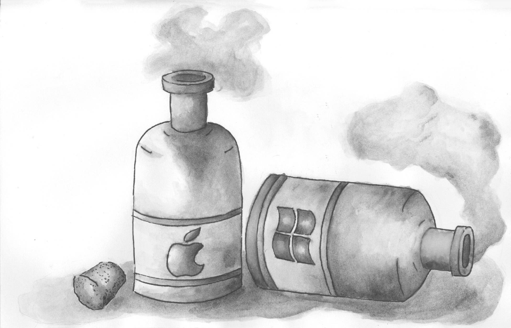

# A Dao of Web design
### By *Cailee Mitchell*

### Ebb & Flow
#### Work in Progress

 - [Draft](#draft)
 - [Summary](#a-summary)
 - [Revision](#revision)
 - [Best Practices](#best-practices)
 - [About The Author](#about-the-author)

- - -

As designers, we are ultimately tasked with keeping up with the internet’s ever-changing ways.

Things are borrowed and ideas are tossed away *constantly*. 

These ideas and borrowed tactics are eventually formed into sensible, adaptable concepts.

### A Summary

  There are many factors that make this adaptability difficult at times; such as poor eyesight, screen resolution, and the platform being utilized. You need to consider the following in order to have a successful outcome - focus on what your page will do, avoid HTML for presentation purposes, and never rely on style sheets to provide an accessible page.
  
  How do you create a successful page then? You can use style sheets to aid the appearance of your page, not for control, and use proper percentages in CSS page layouts. Or perhaps you choose to place your colors sparingly and avoid point and pixel sizing. Different readers and different platforms call for endless ways to make your page adaptable for all.
  
  Instead of worrying about the appearance of your page and the dpi difference between Mac and PC, worry about your audience and functionality. This will prepare both you and your page for success, readability, and most importantly - adaptability.

- - -

## Best Practices

#### Naming Things

- Use lowecase for naming files, folders, and in markup.
- Use a hyphen (-) or an underscore (_) and not a space when separating phrases in naming files, folders, and in markup.

#### Project (Folder, Repo) Structure

##### For Example:
- ebb-and-flow
  - README.md
  - index.md
  - index.html
  - img/

- - -

## Draft

As designers, we are ultimately tasked with keeping up with the internet’s ever-changing ways. Things are borrowed and ideas are tossed away constantly. These ideas and borrowed tactics are eventually formed into sensible, adaptable concepts. 

There are many factors that make this adaptability difficult at times; such as poor eyesight, screen resolution, and the platform being utilized. You need to consider the following in order to have a successful outcome - focus on what your page will do, avoid HTML for presentation purposes, and never rely on style sheets to provide an accessible page. 

How do you create a successful page then? You can use style sheets to aid the appearance of your page, not for control, and use proper percentages in CSS page layouts. Or perhaps you choose to place your colors sparingly and avoid point and pixel sizing. Different readers and different platforms call for endless ways to make your page adaptable for all. 

Instead of worrying about the appearance of your page and the dpi difference between Mac and PC, worry about your audience and functionality. This will prepare both you and your page for success, readability, and most importantly - adaptability.

- - -

## Revision

Designers are ultimately tasked with keeping up with the internet’s ever-changing ways. Things are borrowed and ideas are tossed away constantly. These ideas and borrowed tactics are eventually formed into sensible, adaptable concepts. 

Factors such as poor eyesight, screen resolution, and the platform being utilized can make adaptability difficult. You need to consider the following in order to have a successful outcome - focus on what your page will do, avoid HTML for presentation purposes, and never rely on style sheets to provide an accessible page. 

To make an adaptable page, use style sheets to aid appearance, not for control, and use proper percentages in CSS page layouts. You may also find placing colors sparingly and avoiding point and pixel sizing will make a page more adaptable as well. 

Instead of worrying about the appearance of your page and the dpi difference between Mac and PC, worry about audience and functionality. This will prepare both you and your page for success, readability, and most importantly - adaptability.

- - - 

## About The Author

Cailee is a sophomore Graphic Design student currently residing in Beverly, Massachusetts, studying at Montserrat College of Art. She spends her time designing, taking care of her day-to-day responsibilities as a Resident Assistant, deciding which color to dye her hair next, watching old movies and cheesy anime, and playing the same three video games over and over again. As a designer, she tends to have two methods of attack - a dark side and a vintage side. Pieces tend to jump from skulls and poison all the way to yellow Volkswagon buses and flowers and herbs. Cailee is also trying her luck at printmaking as a new form of design for herself. Not conforming to one side of a design aesthetic tends to keep her on her toes and having a wide range of sketches and variety within my work. 
